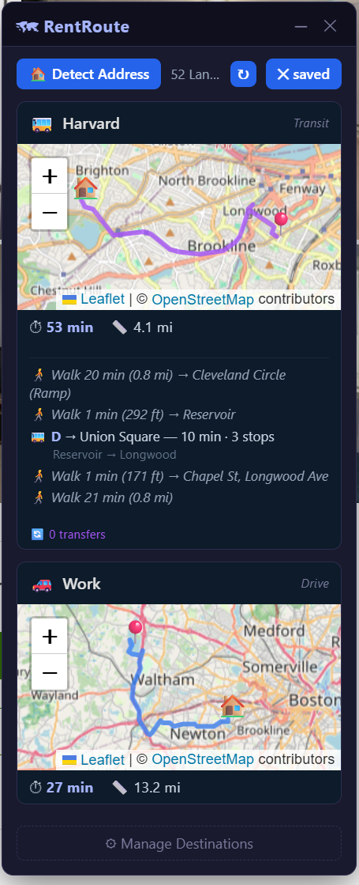
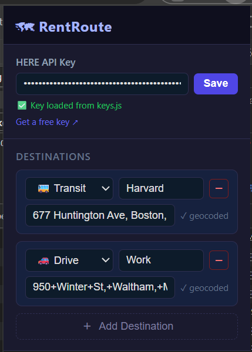

# RentRoute

Chrome MV3 extension. Injects a floating panel on rental listing pages showing commute times + map routes to your saved destinations.


| | |
|---|---|
|  |  |

## Stack

- **Routing**: HERE Routing v8 (car/bike/pedestrian) + HERE Public Transit v8
- **Geocoding**: Nominatim (OpenStreetMap)
- **Maps**: Leaflet.js (bundled in `lib/`)
- **Polyline decoding**: Custom HERE Flexible Polyline decoder (`modules/flexpolyline.js`)

## Supported Sites

Zillow · Apartments.com · Realtor.com

## File Map

```
content.js          Entry point — loads modules, injects panel, starts SPA watcher
background.js       Service worker — proxies fetch requests, injects Leaflet
popup.html/js       Extension popup — API key status, manage destinations
keys.js             API credentials (gitignored)

modules/
  api.js            Geocoding + HERE routing + transit, rate limiting, caching
  detect.js         Address detection (site rules, saved selectors, click-to-pick, SPA polling)
  panel.js          Floating panel DOM — cards, maps, transit leg breakdown, drag
  map.js            Leaflet map init per card (route polyline, origin/dest markers)
  state.js          Chrome storage wrapper, destination CRUD, API key loader
  logger.js         Namespaced console logger with level filtering
  flexpolyline.js   HERE Flexible Polyline → GeoJSON decoder

styles/
  panel.css         Panel, cards, transit legs, pick overlay
  popup.css         Popup page styles

.github/
  copilot_instructions.md   Coding agent rules — stack, structure, patterns, debug cycle
  ai_instructions.md        AI session log — per-session dev history and prompts
```

## How It Works

1. `content.js` loads on matching sites, injects Leaflet into the isolated world, then dynamic-imports all modules
2. `detect.js` auto-reads the listing address via per-site CSS selectors (or a previously saved selector). Falls back to click-to-pick mode
3. SPA watcher polls every 2s for URL or address text changes — auto-refreshes on navigation
4. For each saved destination, `api.js` geocodes both endpoints (Nominatim), then requests a route from HERE
5. Transit routes return full leg breakdown: walking segments with distance/stop names, bus/rail lines with headsign, stop count, departure/arrival stops
6. `panel.js` renders a card per destination with Leaflet map + route polyline + stats

## API Keys

`keys.js` exports `HERE_API_KEY` and `HERE_APP_ID`. File is gitignored. Without it, the extension falls back to a key stored in `chrome.storage`.

## Rate Limits

| Service | Limit | Enforced gap |
|---------|-------|-------------|
| HERE Routing | 10 RPS | 100 ms |
| HERE Transit | 10 RPS | 100 ms |
| Nominatim | ~1 RPS | 1100 ms |
